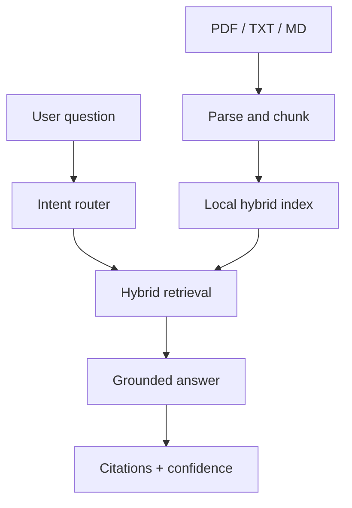

# Research Intelligence Copilot

[🚀 Open the Live Application](https://srilakshmi-research-copilot.streamlit.app)

A production-style Retrieval-Augmented Generation (RAG) application that turns
research documents into a searchable, cited knowledge base.

The project is designed as a portfolio demonstration of document ingestion,
hybrid retrieval, grounded answer generation, evaluation, API development,
testing, containerization, and CI.

## What it demonstrates

- PDF and text ingestion with source metadata
- Configurable chunking with overlap
- Hybrid retrieval: semantic hashing vectors + BM25-style lexical scoring
- Grounded answers with inline source citations
- Agent-style routing for search, summary, comparison, and general questions
- FastAPI REST endpoints and a Streamlit interface
- Retrieval evaluation using Recall@K and Mean Reciprocal Rank
- Unit and API tests
- Docker and GitHub Actions
- Optional OpenAI answer generation; fully runnable without an API key

## Architecture



## Quick start

### 1. Create a virtual environment

```bash
python -m venv .venv
```

Activate it on Windows PowerShell:

```powershell
.venv\Scripts\Activate.ps1
```

Activate it on macOS or Linux:

```bash
source .venv/bin/activate
```

### 2. Install the project

```bash
pip install -e ".[dev]"
```

### 3. Ingest the sample documents

```bash
python -m research_copilot.cli ingest data/sample_docs
```

### 4. Ask a question

```bash
python -m research_copilot.cli ask "What are the main benefits of retrieval evaluation?"
```

### 5. Run the API

```bash
uvicorn research_copilot.api:app --reload
```

Open `http://127.0.0.1:8000/docs`.

### 6. Run the Streamlit UI

```bash
streamlit run app.py
```

## API examples

Ingest a local directory:

```bash
curl -X POST http://127.0.0.1:8000/ingest \
  -H "Content-Type: application/json" \
  -d "{\"path\":\"data/sample_docs\"}"
```

Ask a question:

```bash
curl -X POST http://127.0.0.1:8000/query \
  -H "Content-Type: application/json" \
  -d "{\"question\":\"How should a RAG system be evaluated?\",\"top_k\":4}"
```

## Optional OpenAI generation

The default extractive generator is deterministic and requires no external
service. To use an OpenAI model, install the optional dependency and configure
environment variables:

```bash
pip install -e ".[openai]"
```

Copy `.env.example` to `.env`, add your key, and set:

```text
GENERATOR_PROVIDER=openai
OPENAI_MODEL=gpt-4.1-mini
```

Never commit `.env` or an API key.

## Evaluation

The included evaluation set checks whether the correct source appears in the
top retrieved chunks.

```bash
python -m research_copilot.cli evaluate data/evaluation/questions.json
```

Example output:

```json
{
  "questions": 3,
  "recall_at_k": 1.0,
  "mean_reciprocal_rank": 1.0
}
```

## Testing and quality

```bash
pytest
ruff check .
```

## Docker

```bash
docker build -t research-copilot .
docker run --rm -p 8000:8000 research-copilot
```

## Repository structure

```text
research-intelligence-copilot/
├── research_copilot/
│   ├── api.py          # REST API
│   ├── chunking.py     # text splitting
│   ├── cli.py          # command-line interface
│   ├── config.py       # environment configuration
│   ├── evaluation.py   # Recall@K and MRR
│   ├── generation.py   # extractive/OpenAI answers
│   ├── ingestion.py    # PDF/text loading
│   ├── pipeline.py     # end-to-end RAG orchestration
│   ├── retrieval.py    # hybrid search
│   └── schemas.py      # typed data contracts
├── tests/
├── data/sample_docs/
├── app.py
├── Dockerfile
└── .github/workflows/ci.yml
```

## Responsible AI notes

- Answers are constrained to retrieved evidence.
- Every answer returns source citations.
- Low-confidence responses explicitly say the evidence is insufficient.
- Uploaded or indexed documents may contain sensitive data; do not use
  confidential material in a public demo.
- Retrieval scores are useful ranking signals, not calibrated probabilities.

## Suggested demo

Record a 60-90 second video:

1. Show the repository and architecture.
2. Ingest three documents.
3. Ask one answerable question and point to citations.
4. Ask one unanswerable question and show the safe fallback.
5. Open the FastAPI documentation and the CI check.

## Roadmap

- Add reranking with a cross-encoder
- Add PostgreSQL/pgvector persistence
- Add tracing and token/cost dashboards
- Add authentication and per-user collections
- Deploy to Azure Container Apps, AWS App Runner, or Google Cloud Run

## License

MIT
